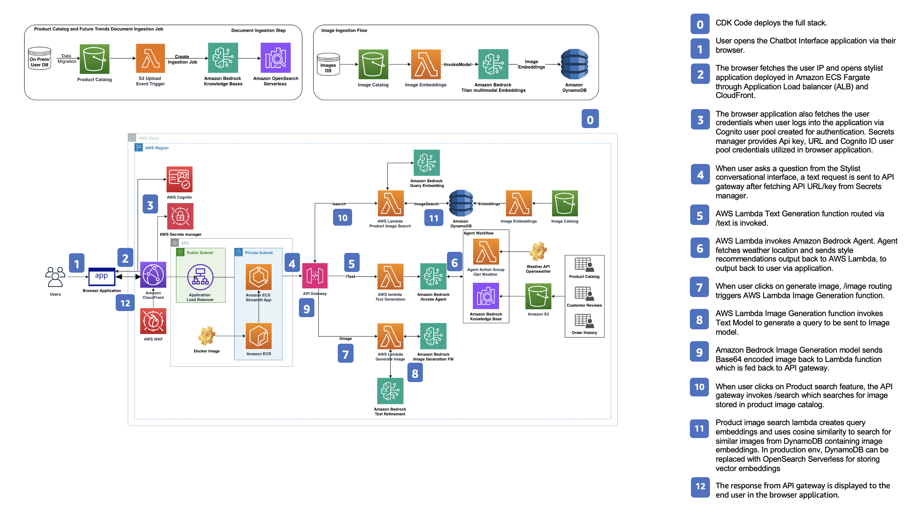

# Guidance for Virtual Personal Stylist on AWS

This repository contains guidance for implementing an Generative AI powered virtual personal stylist using Amazon Bedrock. The solution is designed for e-commerce businesses looking to enhance customer engagement and provide style recommendations.

## Table of Contents

1. [Overview](#overview)
    - [Cost](#cost)
2. [Prerequisites](#prerequisites)
    - [Operating System](#operating-system)
3. [Deployment Steps](#deployment-steps)
4. [Deployment Validation](#deployment-validation)
5. [Running the Guidance](#running-the-guidance)
6. [Next Steps](#next-steps)
7. [Cleanup](#cleanup)
8. [FAQ, known issues, additional considerations, and limitations](#faq-known-issues-additional-considerations-and-limitations)
9. [Revisions](#revisions)
10. [Notices](#notices)
11. [Authors](#authors)

## Overview

This guidance is designed to showcase how you can leverage Amazon Bedrock, that provides knowledge bases and agents, to build a personalized virtual styling assistant. The goal is to create a new shopping experience for customers where they can interact with an AI-powered stylist to help them put together outfits for specific occasions, such as going back to the office.

By using techniques like text and image generation, chat experience, entity extraction, and retrieval-augmented generation (RAG), this guidance demonstrates how you can build an intelligent and engaging virtual styling assistant that can provide personalized recommendations and help customers find the perfect look.

## Architecture Diagram



## High-Level Overview and Flow

1. **User Interaction**: The user interacts with the virtual styling assistant through a chat interface, where they can describe their fashion needs, preferences, and any specific occasions they need to dress for.

2. **Intent and Entity Extraction**: The chat interface uses natural language processing (NLP) techniques to extract the user's intents and relevant entities, such as clothing items, occasions, and personal style preferences.

3. **Knowledge Base and Retrieval-Augmented Generation (RAG)**: The extracted intents and entities are used to query the Amazon Bedrock knowledge base, which contains a comprehensive dataset of fashion items, styling recommendations, and related information. The RAG model then generates personalized styling recommendations by combining the retrieved knowledge with the user's input.

4. **Text and Image Generation**: The virtual stylist uses language models to generate textual responses, providing the user with detailed styling recommendations and explanations. It also leverages image generation models to create visual representations of the recommended outfits.

5. **Personalized Recommendations**: The virtual stylist presents the user with a set of personalized styling recommendations, including a description of the outfit and the associated items. The user can then provide feedback or request additional recommendations.

6. **Seamless Integration**: The virtual styling assistant is integrated into the customer's shopping experience, enabling them to easily browse and purchase the recommended items directly from the application.

By following this architecture, you can build a virtual personal stylist that offers a unique and engaging shopping experience, helping customers find the perfect outfits for their needs and preferences.

### Cost

Pricing for Bedrock involves charges for model inference and customization. Checkout the [cost calculator](https://calculator.aws/#/estimate?id=d6c9881b3009a6d2d79466bac141fb029821284c) for deploying this project. Note that some token pricing for 3P models on Amazon Bedrock is not included in the cost calculator.

*Note: For the most current and detailed pricing information for Amazon Bedrock, please refer to the [Amazon Bedrock Pricing Page](https://aws.amazon.com/bedrock/pricing/).*

We recommend creating a [Budget](https://docs.aws.amazon.com/cost-management/latest/userguide/budgets-managing-costs.html) through [AWS Cost Explorer](https://aws.amazon.com/aws-cost-management/aws-cost-explorer/) to help manage costs. Prices are subject to change. For full details, refer to the pricing webpage for each AWS service used in this Guidance._

### Sample Cost Table

**Note : Once you have created a sample cost table using AWS Pricing Calculator, copy the cost breakdown to below table and upload a PDF of the cost estimation on BuilderSpace. Do not add the link to the pricing calculator in the ReadMe.**

The following table provides a sample cost breakdown for deploying this Guidance with the default parameters in the US East (N. Virginia) Region for one month.

<!-- | AWS service  | Dimensions | Cost [USD] |
| ----------- | ------------ | ------------ |
| Amazon API Gateway | 1,000,000 REST API calls per month  | $ 3.50month |
| Amazon Cognito | 1,000 active users per month without advanced security feature | $ 0.00 | -->

<div class="overflow-table">
| Description | Service | Upfront | Monthly | First 12 months total | Currency | Status | Configuration summary |
|-------------|----------|---------|---------|------------------------|----------|---------|-------------------------|
| TextGeneration Lambda | AWS Lambda | 0 | 0 | 0 | USD | | Architecture (x86), Number of requests (10 per hour), Amount of ephemeral storage allocated (512 MB) |
| | AWS Secrets Manager | 0 | 1.3 | 15.6 | USD | | Number of secrets (2), Average duration of each secret (30 days), Number of API calls (100000 per month) |
| ImageGeneration Lambda | AWS Lambda | 0 | 0 | 0 | USD | | Architecture (x86), Number of requests (100000 per month), Amount of ephemeral storage allocated (512 MB) |
| | S3 Standard | 0 | 23.88 | 286.56 | USD | | S3 Standard storage (1 TB per month) |
| | Application Load Balancer | 0 | 77.75 | 933 | USD | | Number of Application Load Balancers (1) |
| | AWS Fargate | 0 | 34.15 | 409.8 | USD | | Operating system (Linux), CPU Architecture (ARM), Average duration (20 minutes), Number of tasks or pods (20 per day), Amount of memory allocated (10 GB), Amount of ephemeral storage allocated for Amazon ECS (20 GB) |
| | Amazon API Gateway | 0 | 62.74 | 752.88 | USD | | Average size of each request (3400 KB), REST API request units (millions), Average message size (32 KB), Requests (10 per month) |
| | Amazon OpenSearch Service | 0 | 703.2 | 8438.4 | USD | | How many Indexing OCUs? (2), How many Search and Query OCUs? (2), How big is the index data? (100 GB) |
| | Titan Text Embeddings | 0 | 100 | 1200 | USD | | Number of Input tokens (1000 million per month) |
| | Titan Multimodal Embeddings | 0 | 220 | 2640 | USD | | Number of Input Images (1 million per month), Number of input tokens (200 million per month) |
| | AWS Lambda | 0 | 0 | 0 | USD | | Architecture (x86), Amount of ephemeral storage allocated (512 MB), Number of requests (100000 per month) |
| | AWS Lambda | 0 | 0 | 0 | USD | | Architecture (x86), Amount of ephemeral storage allocated (512 MB), Number of requests (100000 per month) |
| | Amazon Cognito | 0 | 5 | 60 | USD | | Advanced security features (Enabled), Number of monthly active users (MAU) (100) |
| | DynamoDB provisioned capacity | 780 | 146.55 | 2538.6 | USD | | Average item size (all attributes) (5 KB), Data storage size (100 GB) |
| | AWS Lambda | 0 | 14.17 | 170.04 | USD | | Architecture (x86), Amount of ephemeral storage allocated (512 MB), Number of requests (1000000 per month) |
</div>

## Prerequisites

### Operating System

- Talk about the base Operating System (OS) and environment that can be used to run or deploy this Guidance, such as *Mac, Linux, or Windows*. Include all installable packages or modules required for the deployment. 
- By default, assume Amazon Linux 2/Amazon Linux 2023 AMI as the base environment. All packages that are not available by default in AMI must be listed out.  Include the specific version number of the package or module.

**Example:**
“These deployment instructions are optimized to best work on **<Amazon Linux 2 AMI>**.  Deployment in another OS may require additional steps.”

- Include install commands for packages, if applicable.

### Third-party tools

- Streamlit
- Openweathermap API
- Python 3.x

### AWS account requirements

**Required resources:**

- AWS account with access to Amazon Bedrock
Amazon Bedrock
- S3 bucket
- VPC
- IAM role with specific permissions

### Requesting Access to AWS Bedrock

1. Log in to the AWS Management Console
2. Search for "Bedrock" in the search bar
3. Click "Get Started" on the Amazon Bedrock service page
4. Click "Manage Model Access" in the popup
5. Select "Amazon" from the list of available models
6. Click "Request Model Access" at the bottom of the page

### Supported Regions

The the services used in the Guidance do not support all Regions, hence the guidance package is well suited to be deployed in `us-west-2` and `us-east-1` region.

## Deployment Steps

1. Clone this repo to your computer using ```git clone repo-name```
2. Navigate to the folder: stylistv1 using ```cd stylistv1```
3. Install packages in requirements using command ```pip install requirement.txt```
4. This project is a Python Project. Switch to the Virtual Env using the below command: ```$ python3 -m venv .venv```
5. After the init process completes and the virtualenv is created, you can use the following step to activate your virtualenv. Execute the following to activate the environemnt ```$ source .venv/bin/activate```. If you are a Windows platform, you would activate the virtualenv like this: ```% .venv\Scripts\activate.bat```
6. Install the required dependencies using the command : ```$ pip install -r requirements.txt```
7. Initialize CDK within the project using the command: ```$ cdk init```
8. Bootstrap the CDK environment using the command : ```$ cdk bootstrap```
9. Deploy the Backend Components running the following command: ```$ cdk deploy --context my_ip={ENTER_YOUR_IP}```

## Deployment Validation

- Once the project is deployed, AWS assets are created in your application. You will have a bunch of resources spun up in your AWS account including Lambda functions, S3 bucket, API Gateway, ECR repository and ECS Fargate service.
- Open CloudFormation console and verify the status of the template with the name starting with `VirtualStylist` with all the resources under `resources` section successfully created. You can navigate to the S3 bucket, Lambda functions, API Gateway or DynamoDB to check the configuration and setup.

## Running the Guidance

- Once cdk stack is deployed and assets are created, you can navigate setup the Amazon Knowledge Base and Amazon Bedrock Agents to leverage custom weather tool.

- "Amazon Bedrock Knowledge base creation" - Navigate to Amazon Bedrock Knowledge base in AWS console. Follow [instructions](https://docs.aws.amazon.com/bedrock/latest/userguide/knowledge-base-create.html) to create your own Bedrock Knowledge Base with Opensearch serverless vector DB in your account. Provide a knowledge base name. Further, provide the S3 URI of the object containing the files for the data source that you prepared, that is, select the S3 as data source to your Knowledge base setup that got created due to CDK deployment. You can keep the chunking strategy as "default", select Titan Embeddings model to embed the information and select `Quick create a new vector store` in order to have default option for the vector DB when creating the knowledge base. Note the `data source ID` and `knowledge base ID` once the knowledge base has been created. You will add the `Data source ID` and `knoweldge base ID` as environment variables to AWS lambda Virtual Stylist Text function that resulted from CDK deployment. These 2 values will also be added to the environment variables in `Ingestion Lambda function` responsible to ingesting any new product catalog or customer reviews files uploaded to your designated S3 bucket.

- "Amazon Bedrock Agent Creation" - Navigate to Amazon Bedrock Agents in AWS console. Click on `Create new agent` to initiate building a new Bedrock Agent. Follow the instructions [here](https://docs.aws.amazon.com/bedrock/latest/userguide/agents-create.html) to create a new agent. Provide a unique name to the Bedrock agent and set of instructions to the agent as follows : ```You are an AI Virtual Personal Stylist capable of providing optimal set of clothing recommendations and accessories that can be worn by the user based on their profile. You can ask about user’s age, gender or any style related questions to customize the model output and generate recommendations for the end user. If the user asks about recommendations for certain time or month of the year at a particular location, you can ask for specifics and invoke weather api to get the optimal recommendations. The response should be professional and must not include any information outside of the knowledge base context. You must not respond to any other information apart from providing recommendations or asking relevant information regarding the user’s questions, specifically related to virtual stylist.  You can often provide weather conditions in the output to justify the reasoning for providing certain style recommendations based on weather conditions, forecast, temperature. If the user asks anything irrelevant, please respond with “I’m sorry, I’m a Virtual Stylist, I will not be able to help you with this query”.```. When you click nex, in the `Action groups` section, you can choose `Add` to add action groups to your agent. In our case, select the Action group as weather function lambda that was created due to CDK deployment. Additionally, in the `Knowledge bases` section, select the knowledge base that you just created in the previous step. You can skip other steps and click create to test your Amazon Bedrock Agent. Once the agent configuration and building portion is complted, create an alias and version of your agent. In the `Aliases` section, choose Create. Enter a unique Alias name and provide an optional Description. In order to create a new version, choose `Create a new version and to associate it to this alias`. Under Select throughput, select the option to let your agent run model inference at the rates set for your account, select `On-demand (ODT)`. Then,sSelect Create alias. Once created, note the `AgentID` and `Agent Alias`. These 2 values will be added to the environment variables for Virtual Stylist Text Lambda Function.

- Additional details are provided in our AWS Workshop for Virtual Personal Stylist.

- Once this setup is completed, you can click on the `CfnOutput for CloudFront` which contains the link for running your application in your browser. Paste the link in your browser to launch the application. Feel free to play with the application. Cheers!

Check solution demo for more details - [Solution Demo](https://youtu.be/EqJ7TmTbbD8)

## Next Steps

Provide suggestions and recommendations about how customers can modify the parameters and the components of the Guidance to further enhance it according to their requirements.

## Cleanup

- In order to make sure all the resources are deleted, 
- Include detailed instructions, commands, and console actions to delete the deployed Guidance.
- If the Guidance requires manual deletion of resources, such as the content of an S3 bucket, please specify.

## FAQ, known issues, additional considerations, and limitations

- Please note that in this guidance package, Streamlit application was deployed in ECS fargate and exposed to the user via Cloudfront distribution. Alternatively, another version using `AWS Amplify` with similar security practices can also be deployed and hosted for the end user. 
- Additionally, for this PoC guidance package, DynamoDB was used to store the small number of image embeddings which were vectorized using Amazon Titan embeddings model. When moving into production environment, simply replace Amazon DynamoDB with enterprise grade vector DB applicable to your use case, that is, Opensearch Serverless may be used as an alternative for production workloads.

## Revisions

All notable changes to the version of this guidance package will be documented and shared accordingly.

## Notices

Customers are responsible for making their own independent assessment of the information in this Guidance. This Guidance: (a) is for informational purposes only, (b) represents AWS current product offerings and practices, which are subject to change without notice, and (c) does not create any commitments or assurances from AWS and its affiliates, suppliers or licensors. AWS products or services are provided “as is” without warranties, representations, or conditions of any kind, whether express or implied. AWS responsibilities and liabilities to its customers are controlled by AWS agreements, and this Guidance is not part of, nor does it modify, any agreement between AWS and its customers.

## Authors

- Shikhar Kwatra
