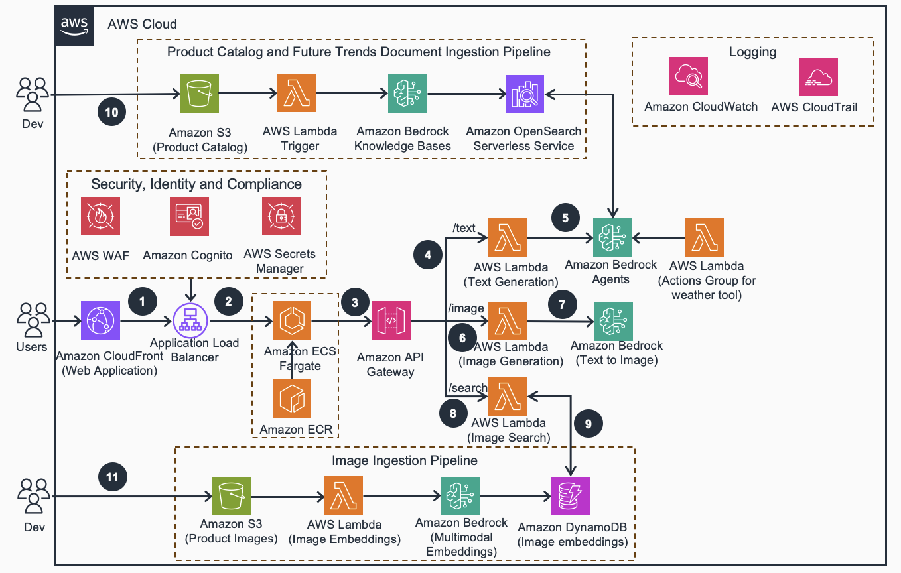
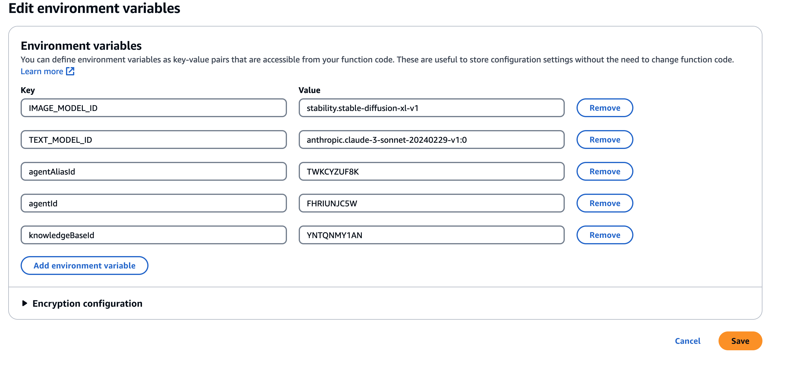
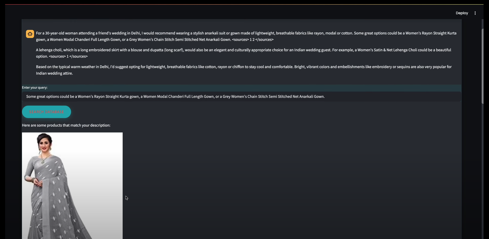

# Guidance for Virtual Personal Stylist on AWS

This repository contains guidance for implementing an Generative AI powered virtual personal stylist using Amazon Bedrock. The solution is designed for e-commerce businesses looking to enhance customer engagement and provide style recommendations.

## Table of Contents

1. [Overview](#overview)
    - [Cost](#cost)
2. [Prerequisites](#prerequisites)
    - [Operating System](#operating-system)
3. [Deployment Steps](#deployment-steps)
4. [Deployment Validation](#deployment-validation)
5. [Running the Guidance](#running-the-guidance)
6. [Next Steps](#next-steps)
7. [Cleanup](#cleanup)
8. [FAQ, known issues, additional considerations, and limitations](#faq-known-issues-additional-considerations-and-limitations)
9. [Revisions](#revisions)
10. [Notices](#notices)
11. [Authors](#authors)

## Overview

In the rapidly evolving world of e-commerce, businesses are constantly seeking new ways to enhance customer engagement and provide personalized shopping experiences. The most common challenges faced by Fashion and Apparel customers are:

- Inability to provide their consumers with positive experience in shopping (Like: Solving sizing inconsistencies, Style preferences, Limited personalization, Slow fashion searches that can be improved with AI-driven searches, Pricing transparency, unclear product details and leading to high return rates)

- Updates to legacy platforms are complex to manage with a limited set of features as compared to a new age platform

- Inconsistent brand experience results in isolated brand sites with less reusability that in turn creates high development and maintenance cost

- High platform investment and limited user experience

- The lack of API endpoints in the existing platform prevents customers from scaling their current offerings 

- Scalability of the platform to meet new campaigns/peaks

This is where the power of Generative AI and Amazon Bedrock come into play, enabling the development of solutions like the Virtual Personal Stylist. The virtual personal stylist is a retail solution designed to help e-commerce businesses revolutionize the way they engage with their customers. By leveraging the capabilities of Amazon Bedrock, this solution combines techniques for generating text and images, chat experiences, entity extraction, and retrieval-augmented generation (RAG) to deliver a personalized shopping experience.

This guidance is designed to showcase how you can leverage Amazon Bedrock, that provides knowledge bases and agents, to build a personalized virtual styling assistant. The goal is to create a new shopping experience for customers where they can interact with an AI-powered stylist to help them put together outfits for specific occasions, such as going back to the office.

By integrating with Amazon Bedrock's Knowledge Bases, the virtual personal stylist solution can provide personalized recommendations based on the customer's past purchases and interests, creating a tailored experience that caters to their unique style and needs.

Moreover, the solution incorporates a chatbot functionality that allows customers to engage in a conversational interface and ask questions about product reviews, addressing their concerns and building trust. The application can also generate concise summaries of customer reviews, helping shoppers make informed purchasing decisions.

To further enhance the customer experience, the virtual personal stylist solution leverages weather data and recommends complementary accessories, ensuring that customers are prepared for their day-to-day activities.

Key Features for this solution include:

1. **User Interaction**: The user interacts with the virtual styling assistant through a chat interface, where they can describe their fashion needs, preferences, and any specific occasions they need to dress for.

2. **Intent and Entity Extraction**: The chat interface uses natural language processing (NLP) techniques to extract the user's intents and relevant entities, such as clothing items, occasions, and personal style preferences.

3. **Knowledge Base and Retrieval-Augmented Generation (RAG)**: The extracted intents and entities are used to query the Amazon Bedrock knowledge base, which contains a comprehensive dataset of fashion items, styling recommendations, and related information. The RAG model then generates personalized styling recommendations by combining the retrieved knowledge with the user's input.

4. **Text and Image Generation**: The virtual stylist uses language models to generate textual responses, providing the user with detailed styling recommendations and explanations. It also leverages image generation models to create visual representations of the recommended outfits.

5. **Personalized Recommendations**: The virtual stylist presents the user with a set of personalized styling recommendations, including a description of the outfit and the associated items. The user can then provide feedback or request additional recommendations.

6. **Seamless Integration**: The virtual styling assistant is integrated into the customer's shopping experience, enabling them to easily browse and purchase the recommended items directly from the application.

By following this architecture, you can build a virtual personal stylist that offers a unique and engaging shopping experience, helping customers find the perfect outfits for their needs and preferences.

## Architecture Diagram



## High-Level Overview and Flow

1. The app is hosted on Amazon ECS Fargate and served via Amazon CloudFront coupled with AWS Web Application Firewall. 

2. The user authenticates to the application via Amazon Cognito user pools. The application retrieves an API key, URL, and Amazon Cognito user pool ID from AWS Secrets Manager.

3. User query is sent to Amazon API gateway using API URL/key stored in AWS Secrets manager

4. AWS Lambda Text Generation function routed via /text is invoked that calls Amazon Bedrock Agents.

5. Bedrock Agents uses location to determine weather and responds with styling recommendations leveraging data stored in Amazon S3. This data is indexed in Amazon OpenSearch Serverless using Knowledge Bases for Amazon Bedrock.

6. When user clicks on generate image, /image routing triggers Lambda Image Generation function. 

7. Lambda Image Generation function queries Amazon Bedrock Image Generation model, that sends Base64 encoded image back to Lambda function which is fed back to API gateway.

8. When user clicks on Product search feature, the API gateway invokes /search which searches for image embeddings stored in Amazon Dynamo DB. Images stored in S3 triggers Lambda function to create multimodal image embeddings and insert the embeddings in Dynamo DB.

9. Product image search Lambda creates query embeddings and uses cosine similarity to search for similar images from DynamoDB. The top 3 ranked images as a response from API gateway is displayed to the end user in the browser application. 

10. Product Catalog Ingestion pipeline: When user uploads new product catalog files to Amazon S3 bucket, AWS Lambda event is triggered that invokes document ingestion job on Knowledge Bases for Amazon Bedrock. Knowledge bases for Amazon Bedrock creates vector index in vector database i.e. Amazon OpenSearch Serverless. The data becomes searchable as it gets stored and indexed in the vector DB.

11. Image Ingestion Pipeline: When user uploads images from their fashion catalog to Amazon S3 bucket, AWS Lambda event is triggered, which invokes Amazon Titan Multimodal embeddings model available on Amazon Bedrock to create image embeddings of the incoming images. The image embeddings are then indexed and stored in Amazon Dynamo DB. 
(Note: In production applications, Dynamo DB maybe replaced with Amazon OpenSearch Serverless for storing image embeddings. )

### Cost

Pricing for Bedrock involves charges for model inference and customization. Note that some token pricing for 3P models on Amazon Bedrock is not included in the cost calculator

<!-- Check out the [cost calculator](https://calculator.aws/#/estimate?id=d6c9881b3009a6d2d79466bac141fb029821284c) for deploying this project. -->

*Note: For the most current and detailed pricing information for Amazon Bedrock, please refer to the [Amazon Bedrock Pricing Page](https://aws.amazon.com/bedrock/pricing/).*

_We recommend creating a [Budget](https://docs.aws.amazon.com/cost-management/latest/userguide/budgets-managing-costs.html) through [AWS Cost Explorer](https://aws.amazon.com/aws-cost-management/aws-cost-explorer/) to help manage costs. Prices are subject to change. For full details, refer to the pricing webpage for each AWS service used in this Guidance._

### Sample Cost Table

**Note : Once you have created a sample cost table using AWS Pricing Calculator, copy the cost breakdown to below table and upload a PDF of the cost estimation on BuilderSpace. Do not add the link to the pricing calculator in the ReadMe.**

The following table provides a sample cost breakdown for deploying this Guidance with the default parameters in the US East (N. Virginia) Region for one month.

<!-- | AWS service  | Dimensions | Cost [USD] |
| ----------- | ------------ | ------------ |
| Amazon API Gateway | 1,000,000 REST API calls per month  | $ 3.50month |
| Amazon Cognito | 1,000 active users per month without advanced security feature | $ 0.00 | -->

| Description | Service | Upfront [USD] | Monthly [USD] | First 12 months total [USD] | Configuration summary |
|-------------|----------|--------------|--------------|----------------------------|-------------------------|
| TextGeneration Lambda | AWS Lambda | 0 | 0 | 0 | Architecture (x86), Number of requests (10 per hour), Amount of ephemeral storage allocated (512 MB) |
| | AWS Secrets Manager | 0 | 1.3 | 15.6 | Number of secrets (2), Average duration of each secret (30 days), Number of API calls (100000 per month) |
| ImageGeneration Lambda | AWS Lambda | 0 | 0 | 0 | Architecture (x86), Number of requests (100000 per month), Amount of ephemeral storage allocated (512 MB) |
| | S3 Standard | 0 | 23.88 | 286.56 | S3 Standard storage (1 TB per month) |
| | Application Load Balancer | 0 | 77.75 | 933 | Number of Application Load Balancers (1) |
| | AWS Fargate | 0 | 34.15 | 409.8 | Operating system (Linux), CPU Architecture (ARM), Average duration (20 minutes), Number of tasks or pods (20 per day), Amount of memory allocated (10 GB), Amount of ephemeral storage allocated for Amazon ECS (20 GB) |
| | Amazon API Gateway | 0 | 62.74 | 752.88 | Average size of each request (3400 KB), REST API request units (millions), Average message size (32 KB), Requests (10 per month) |
| | Amazon OpenSearch Service | 0 | 703.2 | 8438.4 | How many Indexing OCUs? (2), How many Search and Query OCUs? (2), How big is the index data? (100 GB) |
| | Titan Text Embeddings | 0 | 100 | 1200 | Number of Input tokens (1000 million per month) |
| | Titan Multimodal Embeddings | 0 | 220 | 2640 | Number of Input Images (1 million per month), Number of input tokens (200 million per month) |
| | AWS Lambda | 0 | 0 | 0 | Architecture (x86), Amount of ephemeral storage allocated (512 MB), Number of requests (100000 per month) |
| | AWS Lambda | 0 | 0 | 0 | Architecture (x86), Amount of ephemeral storage allocated (512 MB), Number of requests (100000 per month) |
| | Amazon Cognito | 0 | 5 | 60 | Advanced security features (Enabled), Number of monthly active users (MAU) (100) |
| | DynamoDB provisioned capacity | 780 | 146.55 | 2538.6 | Average item size (all attributes) (5 KB), Data storage size (100 GB) |
| | AWS Lambda | 0 | 14.17 | 170.04 | Architecture (x86), Amount of ephemeral storage allocated (512 MB), Number of requests (1000000 per month) |
| | Bedrock Claude Sonnet | 0 | 8100 | 97200 | Text Generation model available on Amazon Bedrock |
| | Stable Diffusion SDXL 1 | 0 | 4000 | 48000 | Image generation model available on Amazon Bedrock|

## Prerequisites

### Operating System

These deployment instructions are optimized to best work on a pre-configured Amazon Linux 2023 AWS Cloud9 development environment. Refer to the [Individual user setup for AWS Cloud9](https://docs.aws.amazon.com/cloud9/latest/user-guide/setup-express.html) for more information on how to set up Cloud9 as a user in the AWS account. Deployment using another OS may require additional steps, and configured python libraries (see [Third-party tools](#third-party-tools)).

### Third-party tools

Before deploying the guidance code, ensure that the following required tools have been installed:

- AWS Cloud Development Kit (CDK) >= 2.126.0
- Python >= 3.8
- Streamlit
- Openweathermap API

### AWS account requirements

**Required resources:**

- [Bedrock Model access](https://docs.aws.amazon.com/bedrock/latest/userguide/model-access.html) for Claude 3 Sonnet, Stable Diffusion SDXL 1.0 and Amazon Titan Multimodal embeddings
- S3 bucket
- VPC
- IAM role with specific permissions
- AWS CLI
- [AWS CDK](https://docs.aws.amazon.com/cdk/v2/guide/getting_started.html)

### Requesting Access to AWS Bedrock

1. Log in to the AWS Management Console
2. Search for "Bedrock" in the search bar
3. Click "Get Started" on the Amazon Bedrock service page
4. Click "Manage Model Access" in the popup
5. Select "Amazon" from the list of available models
6. Click "Request Model Access" at the bottom of the page

### Supported Regions

The the services used in the Guidance do not support all Regions, hence the guidance package is well suited to be deployed in `us-west-2` and `us-east-1` region.

### aws cdk bootstrap

This Guidance uses AWS CDK. If you are using aws-cdk for the first time, please see the [Bootstrapping](https://docs.aws.amazon.com/cdk/v2/guide/bootstrapping.html) section of the AWS Cloud Development Kit (AWS CDK) v2 developer guide, to provision the required resources, before you can deploy AWS CDK apps into an AWS environment.

## Deployment Steps

1. In the Cloud9 IDE, use the terminal to clone the repository:
   ```
   git clone https://github.com/aws-solutions-library-samples/guidance-for-virtual-personal-stylist-on-aws.git
   ```

2. Navigate to the folder: source using
   ```
   cd source
   ```

3. This project is a Python Project. Switch to the Virtual Env using the below command:
   ```
   python3 -m venv .venv
   ```

4. After the init process completes and the virtualenv is created, you can use the following step to activate your virtualenv. Execute the following to activate the environment: 
   ```
   source .venv/bin/activate
   ```

5. Install the required dependencies in the virtual environment. Please make sure you have installed aws cdk following the pre-requisites :
   ```
   python -m pip install -r requirements.txt
   ```

6. Initialize CDK within the project using the command:
   ```
   cdk init
   ```

7. Bootstrap the CDK environment using the command :
   ```
   cdk bootstrap
   ```

8. Verify that the CDK deployment correctly synthesizes the CloudFormation template:
   ```
   cdk synth
   ```

9. Deploy the Backend Components running the following command:
   ```
   cdk deploy --context my_ip={ENTER_YOUR_IP}
   ```

Once you run the above command in cloud 9 environment, it will take approximately *10 minutes* to deploy the entire stack. Note that as part of this stack creation, public IP Address was added in the cdk command as a security measure, such that only the user deploying this stack in their account is able to access the application via Load Balancer which has security group configured to only accept incoming requests from your IP.

## Deployment Validation

- To verify a successful deployment of this guidance, open [CloudFormation](https://console.aws.amazon.com/cloudformation/home) console, and verify that the status of the stack named `VirtualStylistStack` is `CREATE_COMPLETE`.
- Once the project is deployed, AWS assets are created in your application. You will have a bunch of resources spun up in your AWS account including Lambda functions, S3 bucket, API Gateway, ECR repository and ECS Fargate service.

## Running the Guidance

- Once cdk stack is deployed and assets are created, you can navigate setup the Amazon Knowledge Base and Amazon Bedrock Agents to leverage custom weather tool.

- **Amazon Bedrock Knowledge base creation** 
  - Navigate to Amazon Bedrock Knowledge base in AWS console.
  - Follow [instructions](https://docs.aws.amazon.com/bedrock/latest/userguide/knowledge-base-create.html) to create your own Bedrock Knowledge Base with Opensearch serverless vector DB in your account.
  - Provide a knowledge base name.
  - Further, provide the S3 URI of the object containing the files for the data source that you prepared, that is, select the S3 as data source to your Knowledge base setup that got created due to CDK deployment.
    - For this, click `browse s3` and select bucket starting with the name - `virtualstyliststack-virtualstylistappbucketcdk`
  - Next, you can keep the chunking strategy as "default", select `Titan Text Embeddings v2` model to embed the information and select `Quick create a new vector store` in order to have default option for the vector DB when creating the knowledge base. Note that Knowledge Base can take approximately 10 minutes to be created.
  - Take note of the `data source ID` and `knowledge base ID` once the knowledge base has been created. You will add the `Data source ID` and `knoweldge base ID` as environment variables to AWS lambda Virtual Stylist Text function that resulted from CDK deployment.
  - These 2 values will also be added to the environment variables in `Ingestion Lambda function` responsible to ingesting any new product catalog or customer reviews files uploaded to your designated S3 bucket.

- **Amazon Bedrock Agent Creation**
  - Navigate to Amazon Bedrock Agents in AWS console. Click on `Create Agent` to initiate building a new Bedrock Agent.
  - Follow the instructions [here](https://docs.aws.amazon.com/bedrock/latest/userguide/agents-create.html) to create a new agent.
  - Provide a unique name to the Bedrock agent. Agent description is optional, so that can be skipped.
  - Under `Agent resource role` select `Creat and use a new service role`.
  - Under `select model` section, select `Anthropic Claude 3 Sonnet` model.
  - Next, where it mentions `Instructions for the Agent`, add the below set of instructions to the agent:
   ```
   You are an AI Virtual Personal Stylist capable of providing optimal set of clothing recommendations and accessories that can be worn by the user based on their profile. You can ask about user’s age, gender or any style related questions to customize the model output and generate recommendations for the end user. If the user asks about recommendations for certain time or month of the year at a particular location, you can ask for specifics and invoke weather api to get the optimal recommendations. The response should be professional and must not include any information outside of the knowledge base context. You must not respond to any other information apart from providing recommendations or asking relevant information regarding the user’s questions, specifically related to virtual stylist.  You can often provide weather conditions in the output to justify the reasoning for providing certain style recommendations based on weather conditions, forecast, temperature. If the user asks anything irrelevant, please respond with “I’m sorry, I’m a Virtual Stylist, I will not be able to help you with this query”.
   ```
  - After scrolling further, under the `Action groups` section, you can choose `Add` to add action groups to your agent.
  - In our case, select the Action group as weather function lambda that was created due to CDK deployment. Select an existing Lambda from the dropdown starting with the name `VirtualStylistStack-WeatherFunction..`, as shown below:

  - For the Action group Schema, we will choose `Define via in-line schema editor`. Replace the default schema in the In-line OpenAPI schema editor with the schema provided below:
  ```
   openapi: 3.0.0
   info:
   title: Weather Agent API
   version: 1.0.0
   description: API to get the weather information for a location to recommend clothing for the user.
   paths:
   /get-weather-info:
      get:
      summary: Get the weather information for a location.
      description: Retrieve the weather information for a given location.
      operationId: get-weather-info
      parameters:
         - name: location
            in: query
            description: The name of the location for which weather information is needed.
            required: true
            schema:
            type: string
      responses:
         '200':
            description: Successful response containing the weather information.
            content:
            application/json:
               schema:
                  type: object
                  properties:
                  temperature:
                     type: string
                     description: The current temperature at the location.
                  condition:
                     type: string
                     description: The current weather condition at the location.
   ```
  - Enable the Action status for the action group to influence the Agent's response, and click on `Create`. You will land back on Agent Builder page. Click on `Save` button mentioned on the top next to Agent builder.
  - Next, in the `Knowledge bases` section, select the knowledge base that you just created in the previous step. You can keep rest of the instructions as default. Note that in the instructions for knowledge base, copy paste the following text and click `Add`:
  ```
   Knowlegde base contains information comprising of multiple csv files about product catalog, customer reviews for the products that can be recommended as well as future trends in clothing and style.
  ```
  - Once added, and you land back on Agent builder page, click on `Save` on top right and next, you can click on `Prepare` to prepare the agent to test the latest changes, on the right pane under `Test Agent`. Now, click `Save and Exit` next to Agent builder. 
  - Once the agent configuration and building portion is completed, it's time to create an alias and version of your agent.
  - Click on `Create Alias` under Agent Overview page. In the `Aliases` section, enter a unique Alias name and provide an optional Description. In order to create a new version, choose `Create a new version and to associate it to this alias`.
  - Under Select throughput, select the option to let your agent run model inference at the rates set for your account, select `On-demand (ODT)`.
  - Then,Select `Create Alias`. Once created, note the `AgentID` and `Agent Alias`. These 2 values will be added to the environment variables for Virtual Stylist Text Lambda Function.

- **Set the Environment Variables for Lambda Function**
  - Navigate to AWS console and search for lambda in the search bar. Search for lambda function with the name starting with `VirtualstylistStack-TextFunction..`. The text lambda function is created which is invoked when user desires a textual recommendation from the virtual stylist application. Ensure you input the knowledge base ID, model ID, Agent Alias ID, and Agent Alias in the lambda code within environment variables.
  - Click on `Configuration` and then, navigate to `Environment variables`.
    - Click on the "Edit" button to modify the environment variables.
    - For the "Key" field, you should see some values corresponding to knowledge base ID and other environment variables.
    - For the "Value" field, enter the actual values you obtained from the Amazon Bedrock Agents and Amazon Bedrock for Knowledge Bases section. Click `Save` to apply the changes as shown below.


- **Weather API Agent**
  - The cdk stack additionally deploys weather api agent lambda function. This weather agent lambda function integrates with Amazon Bedrock Agent you created in the earlier steps in order to fetch the accurate weather conditions based on the user's input location within the query.
  - Note that the lambda function created for weather agent needs to have openweather map API key to fetch the accurate weather conditions pertaining to a given location. Follow the below instructions in order to create your weather api key:
    - Navigate to [openweathermap](https://home.openweathermap.org/) and register an account on the website.
    - Once you have created the account, navigate to [API keys web-page](https://home.openweathermap.org/api_keys) and click on generate your weather api key. An api key with the name you type will be created as shown below.

  - Once that has been created, you can use the api key in your Action group lambda function for weather api agent as part of environment variable as shown in the following section.

- **Action Group Lambda Function for Weather API Agent**
  - The Virtual Personal Stylist application uses a Lambda function that is associated with an `Action Group` in the Bedrock Agent. This Lambda function is triggered when the Bedrock Agent is invoked from the text generation lambda function called via front-end of the application.
  - You have already associated this lambda function (`VirtualStylistStack-WeatherFunction..`) to your Amazon Bedrock Agent.
  - Simply navigate to the environment variable of the lambda function as shown earlier and provide `YOUR_OPENWEATHERMAP_API_KEY` you fetched in the previous section. This API key is required to authenticate and make requests to the OpenWeatherMap API.
  - Additionally, we are using requests library in this lambda function to trigger OpenWeatherMap API. By default, requests library does not exist in the existing dependency packages. Follow the next section to create your own lambda layer and attach it to this lambda function.

- **Instructions for creating lambda layer**
  - A Lambda Layer is a mechanism in AWS Lambda that allows you to package and share common code, libraries, or other dependencies that can be used by multiple Lambda functions. This helps to optimize the size of your Lambda functions, as the layer can be shared across functions, reducing the overall deployment package size.
  - In the case of the weather agent Lambda function, the "layers.zip" file should contains the "requests" library, which is required for making HTTP requests to the OpenWeatherMap API. Given below are the instructions to create Lambda Layer for calling requests library in the weather agent lambda function. In order to create the lambda layer, follow the following instructions in your local system:
    - Create a folder through your local terminal (iterm/terminal) using the following command : `mkdir layer`
    - Navigate into the folder : `cd layer`
    - Create a new directory : `mkdir python`
    - Run this command within the folder : `pip install -t python requests`
    - Now, zip the contents of of file within the folder and name is layers.zip using : `zip -r12 layers.zip python`
  - Now that you have created the layers.zip file with r12 (aka runtime python 3.12 version), you should be able to upload this to your lambda function for leveraging in the stylist application.

- **Adding a layer to lambda function**
  - In order to add a layer to a function (console), following the below steps:
    - Open the Functions page  of the Lambda console.
    - Choose the function to configure.
    - Under `Layers`, choose `Add a layer` button.
    - Under `Choose a layer`, choose a layer source:
      - For the AWS layers or Custom layers layer sources, choose a layer from the pull-down menu.
      - Under `Version`, choose a layer version from the pull-down menu.
      - For the `Specify an ARN` layer source, enter an `ARN` in the text box and choose Verify. Then, choose `Add`.
    - Once the layer is added, you can save the function configuration.

The use of a Lambda function, environment variables, and custom libraries (as Lambda Layers) demonstrates the flexibility and extensibility of the Virtual Personal Stylist application, allowing for the integration of various third-party services and functionalities as needed. In case you want to create your own lambda layer, follow the next section.

Apart from the above functions, additional lambda functions are created as part of CDK stack deployment but no setup or configuration changes is required for running the application. The user can now proceed with the front-end deployment instructions.

- **Front-End Configuration**
  - By default, the Streamlit frontend application verifies that a user is authenticated with the Amazon Cognito user pool. Amazon API Gateway checks for the API key in every HTTP request to prevent the unauthorized access to the API. However, if you would like to add access control capabilities, you can use Amazon Verified Permissions that allows you to define your permissions model (e.g., RBAC based on Cognito groups membership) with the help of Cedar policies. Please refer to the "Set up with API Gateway and an identity source" in the [service documentation](https://docs.aws.amazon.com/verifiedpermissions/latest/userguide/policy-stores_create.html). You can use this short video for using Amazon Verified Permissions to create this functionality in the app - [Lambda Authorizer setup](https://youtu.be/R7QuHGbKt5U)

  - Now that the application has been deployed, you can login via the browser using Cloudfront URL or load balancer DNS URL. In case you face any issues: n
    - Navigate to `CloudFront` from AWS console using search bar, click on `Distributions` and select the `CloudFront Distributions` created for you via CDK stack deployment.
    - Once you are within the `CloudFront Distrubution`, click on `Origins`. Under `Origins`, select the origin as shown below and click on `Edit`.
   
    - Under `Settings`, select protocol as `HTTP only` with port `80` as the origin's HTTP port (as shown below). Click on `Save Changes`.
   
    - Now your cloudfront is configured properly to be launched via web browser.

- After opening the app in your browser, you will be presented with login page. In order to login, you need to create a user in Amazon Cognito. With a user pool, your users can sign in to your web or mobile app through Amazon Cognito.

- **Create a new user in Amazon Cognito**
  - Go to the [Amazon Cognito console](https://console.aws.amazon.com/cognito/home) . If prompted, enter your AWS credentials.
  - Navigate to user pools on the left side of the panel. You should see a user pool created via CDK stack.
  - Click on the pre-created user pool. You will land on the image shown below:
   
  - As shown in the image, you can click on `Users` tab below `Getting Started` section and click on `create user` to create your user profile.
  - Now, create a new user by providing username, valid email address and temporary password to login to the application.
  - After this setup, you should be able to login and launch your virtual stylist application!

- Once this setup is completed, you can click on the `CfnOutput for CloudFront` from your `Cloud9` output when you deployed the stack. After deployment, the output of the deployment in the terminal contains the link for running your application in your browser. Paste the link in your browser to launch the application. Feel free to play with the application. Cheers!

- **Product Image Search Feature**
  - The third tab will not run as there are no images in the image bucket at this point. Either you can manually upload the images of your own or follow the below steps to upload selective indo Fashion dataset images.
  - **Uploading Images to S3 for product Image Search Feature**
    - In the application, you will notice a third tab corresponding to image search feature.
    - You can navigate to Kaggle and find the [Indo Fashion dataset](https://www.kaggle.com/datasets/validmodel/indo-fashion-dataset)  as an example. Download the Train_data.json and a subset of jpeg images (say 200) under training images.
    - Once downloaded, store it in the local drive. Users can upload the json file and images to S3 bucket that was created as part of cdk stack deployment.
    - Navigate to your Amazon S3 console and locate the S3 bucket prefixed as `Virtualstyliststack-s3imagebucket...`.
    - Upload the images to s3 bucket. This will trigger an ingesion pipeline which embeds the image using lambda function invoking Amazon Titan multi-modal embeddings model. Once the job is completed, these image vecor embeddings are pushed into Amazon DynamoDb.
    - Now these images are searchable. When the user queries the application for images corresponding to a particular style, cosine similarity is performed in order to search for top 3 images from the database which are displayed to the end user.

## Guidance Demo

Now that all the configuration steps are completed, you should be able to open the Cloudfront URL as detailed above and start playing with the app.

- **Text Generation Feature**
  - Once you login to the app using your username and password that you created in Cognito above, you will land on the Chat portal similar to what is shown below. Note that the UI frontend may look a bit different, thought the key features/functionality will be the same. 
   
  - You can enter the following query in the chat box and click on `Send`:
  ```
  I'm a 30 year old female traveling to Delhi for a friends wedding. What to wear for the function?
  ```
   
  
  - This shows the textual recommendation received for the user based on their profile and weather conditions for the location fetched from Amaon Bedrock Agents interacting with OpenWeatherAPI tool.

- **Image Generation Feature**
  - Now we can copy the text recommendation as shown below and go to Generate Image tab to generate an image recommendation. This invokes Stable Diffusion SDXL1.0 model available on Amazon Bedrock to generate a suitable image from the input text, as shown below in the image.
  - After clickgin on `Generate Image`, you should be able to see an image recommendation generated pertaining to the input text.
   

- **Product Image Search Feature**
  - Now let's navigate to the Product search tab (3rd tab) within the app UI, and try out the search feature. This feature is able to search and display for top 3 images from the stored data (S3) that resembles the search query entered by the user.
  - As shown in the image below, the user copies the previously generated textual recommendation from the LLM availble on Amazon Bedrock and pastes in the the text box to get image recommendations from the image catalog.
  

  - Note that the images pre-existing in the database are being displayed in the output based on the similarity score. If the images corresponding to the text are not present in the your stored data, the image recommendations might not be very useful to the end user.
   

Now you may go back to the chat feature and experiment with out other follow-up actions as shown below. Notice how the Agent asks a follow up question for the user question and provides a clothing recommendation based on information extracted from the query and using RAG approach by extracting custom styling recommendations from the stored data:  
   ```
   I'm planning to go to Alaska for a few days. What to wear?
   ```


- Check solution demo for more details - [Solution Demo](https://youtu.be/EqJ7TmTbbD8)

## Next Steps

Here are some suggestions and recommendations on how customers can modify the parameters and components of the Virtual Personal Stylist application to further enhance it according to their requirements:

1. **Customization of the User Interface (UI)**:
   - Customers can customize the frontend to match their branding and design requirements.
   - They can modify the layout, color scheme, and overall aesthetic of the application to provide a seamless and visually appealing experience for their users.
   - Customers can also integrate the application with their existing web or mobile platforms to provide a more cohesive user experience.

2. **Expansion of the Knowledge Base**:
   - Customers can expand the knowledge base by ingesting additional data sources, such as industry trends, seasonal fashion information, and user preferences.
   - This can help improve the quality and relevance of the styling recommendations provided by the application.
   - Customers can also explore incorporating user feedback and interactions to continuously refine and update the knowledge base.

3. **Integration with External Data Sources**:
   - Customers can integrate the application with additional data sources, such as social media trends, and inventory management systems.
   - This can enable more comprehensive and context-aware recommendations, taking into account factors like current fashion trends, and product availability.

4. **Multilingual and Localization Support**:
   - Customers can extend the application to support multiple languages and cultural preferences, making it accessible to a broader user base.
   - This may involve translating the user interface, adapting the styling recommendations to local fashion trends, and ensuring the application's content is relevant and appropriate for different regions and demographics.

5. **Integration with E-commerce Platforms**:
   - Customers can integrate the Virtual Personal Stylist application with their existing e-commerce platforms, enabling seamless product discovery, purchase, and order fulfillment.
   - This can create a more streamlined and personalized shopping experience for users, where they can directly purchase the recommended items from within the application.

6. **Offline Capabilities and Progressive Web App (PWA) Support**:
   - Customers can explore building a Progressive Web App (PWA) version of the Virtual Personal Stylist, allowing users to access the application offline and providing a more reliable and responsive experience.
   - This can be particularly useful for users with intermittent or unreliable internet connectivity, enhancing the accessibility and usability of the application.

7. **Advanced Analytics and Reporting**:
   - Customers can integrate the application with business intelligence and analytics tools to gain deeper insights into user behavior, recommendation performance, and overall application usage.
   - This can help customers make data-driven decisions to further optimize the Virtual Personal Stylist and better align it with their business objectives.

By exploring these next steps, customers can tailor the Virtual Personal Stylist application to their specific needs, enhance the user experience, and unlock new opportunities for growth and innovation within their fashion and retail businesses.

## Cleanup

### Cleanup of CDK-Deployed Resources

1. **Terminate the CDK app**:
   - Navigate to the CDK app directory in your Cloud9 terminal. In your case, it should be the same directory from where you ran the `cdk deploy` command.
   - Run the following command to destroy the CDK stack and all the resources it manages:```cdk destroy --all```
   - This will remove all the AWS resources created by the CDK app, including Lambda functions, DynamoDB tables, S3 buckets, and more.

2. **Verify resource deletion**:
   - Log in to the AWS Management Console and navigate to the relevant services to ensure all the resources have been successfully deleted.

### Manual Cleanup of Additional Resources

1. **Bedrock Agents**:
   - Log in to the AWS Management Console and navigate to the Amazon Bedrock service.
   - Choose Agents from the left navigation pane.
   - Locate the Bedrock agents used by the Virtual Personal Stylist application. 
   - To delete an agent, choose the option button that's next to the agent you want to delete.
   - A dialog box appears warning you about the consequences of deletion. To confirm that you want to delete the agent, enter delete in the input field and then select Delete.
   - When deletion is complete, a success banner appears.

2. **Knowledge Base**:
   - Before the following steps, make sure to delete the knowledge base from any agents that it's associated with. To do this, carry out the following steps:
     - From the left navigation pane, select Agents.
     - Choose the Name of the agent that you want to delete the knowledge base from.
     - A red banner appears to warn you to delete the reference to the knowledge base, which no longer exists, from the agent.
     - Select the radio button next to the knowledge base that you want to remove. Select More and then choose Delete.

   - Sign in to the AWS Management Console using an IAM role with Amazon Bedrock permissions, and open the [Amazon Bedrock console](https://console.aws.amazon.com/bedrock/).
   - From the left navigation pane, select Knowledge bases.
   - Choose a knowledge base or select the radio button next to a knowledge base. Then choose Delete.
   - Review the warnings for deleting a knowledge base. If you accept these conditions, enter delete in the input box and select Delete to confirm.

3. **S3 Bucket Content**:
   - The Virtual Personal Stylist application may use an S3 bucket to store generated images or other unstructured data.
   - If the S3 bucket was not managed by the CDK app, you will need to delete the contents of the bucket manually.
   - Log in to the AWS Management Console and navigate to the S3 service.
   - Locate the S3 bucket used by the application and delete all the objects within it.
   - Once the bucket is empty, you can delete the bucket itself.

4. **Cognito User Pool**:
   - If the Amazon Cognito user pool was not managed by the CDK app, you will need to delete it manually.
   - Go to the Amazon Cognito [console](https://console.aws.amazon.com/cognito/home). From the navigation, choose User Pools.
   - Select the user pool [code] swb-userpool-<stage>-<awsRegionShortName>.
   - Choose `Delete`.
   - Enter the name of the user pool to confirm.

5. **AWS WAF Configuration**:
   - Sign in to the AWS Management Console and open the [AWS WAF console](https://console.aws.amazon.com/wafv2/).
   - In the navigation pane, choose Web ACLs.
   - Select the name of the web ACL that you want to delete. The console takes you to the web ACL's description, where you can edit it.
   - On the Associated AWS resources tab, for each associated resource, select the radio button next to the resource name and then choose Disassociate. This disassociates the web ACL from your AWS resources.
   - In the navigation pane, choose Web ACLs.
   - Select the radio button next to the web ACL that you are deleting, and then choose Delete.

## FAQ, known issues, additional considerations, and limitations

- Please note that in this guidance package, Streamlit application was deployed in ECS fargate and exposed to the user via Cloudfront distribution. Alternatively, another version using `AWS Amplify` with similar security practices can also be deployed and hosted for the end user. 
- Additionally, for this PoC guidance package, DynamoDB was used to store the small number of image embeddings which were vectorized using Amazon Titan embeddings model. When moving into production environment, simply replace Amazon DynamoDB with enterprise grade vector DB applicable to your use case, that is, Opensearch Serverless may be used as an alternative for production workloads.

## Revisions

All notable changes to the version of this guidance package will be documented and shared accordingly.

## Notices

Customers are responsible for making their own independent assessment of the information in this Guidance. This Guidance: (a) is for informational purposes only, (b) represents AWS current product offerings and practices, which are subject to change without notice, and (c) does not create any commitments or assurances from AWS and its affiliates, suppliers or licensors. AWS products or services are provided “as is” without warranties, representations, or conditions of any kind, whether express or implied. AWS responsibilities and liabilities to its customers are controlled by AWS agreements, and this Guidance is not part of, nor does it modify, any agreement between AWS and its customers.

## Authors

- Shikhar Kwatra
